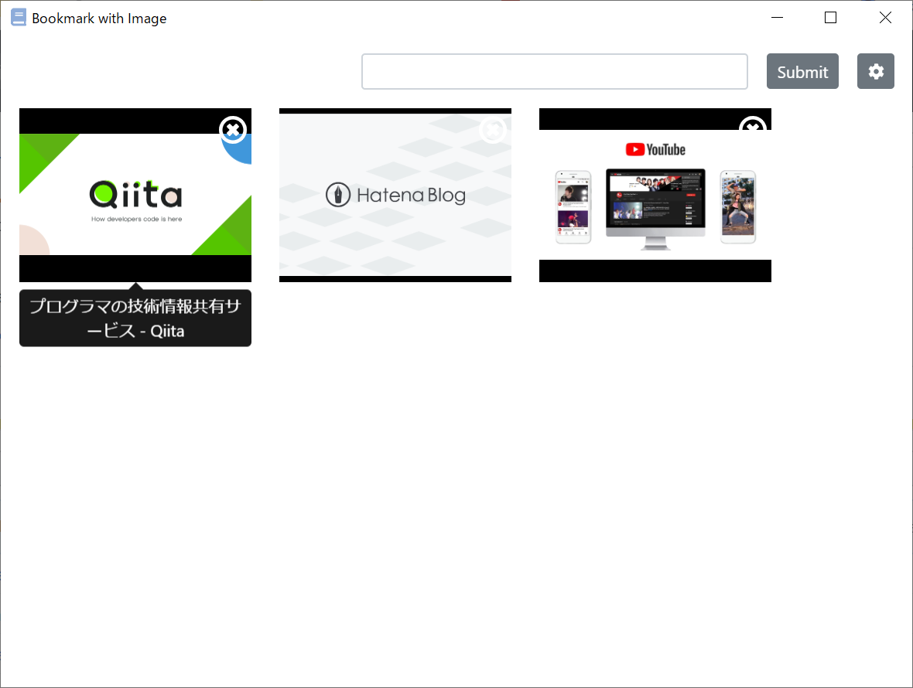

# Bookmark with Images

A simple native app to manage bookmarks with thumbnail images.



## Libraries

* [v2.x](https://github.com/unhurried/bookmark-with-image/blob/v2.0.0/README.md)
  * [Vue.js](https://jp.vuejs.org/index.html) (with Vue CLI4)
  * [BootstrapVue](https://bootstrap-vue.js.org/)
  * [Electron](https://www.electronjs.org/) (through [vue-cli-plugin-electron-builder](https://github.com/nklayman/vue-cli-plugin-electron-builder))
  * [axios](https://github.com/axios/axios)
  * [cheerio-httpcli ](https://www.npmjs.com/package/cheerio-httpcli)
  * [SQLite3](https://www.sqlite.org/index.html) (through [typeorm](https://typeorm.io/))
* [v1.x](https://github.com/unhurried/bookmark-with-image/blob/v1.0.0/README.md)
  * [Electron](https://electronjs.org/)
  * [request-promise](https://www.npmjs.com/package/request-promise)
  * [cheerio-httpcli](https://www.npmjs.com/package/cheerio-httpcli)
  * [nedb](https://github.com/louischatriot/nedb)

## How to start development

### Install dependencies

```shell
npm install
# To build sqlite3 for electron on Windows.
npm install -g node-gyp
npm install -g --production windows-build-tools
npm install sqlite3 --build-from-source --save --runtime=electron --target=6.1.7 --dist-url=https://atom.io/download/electron
```

### Run the application
```
npm run electron:serve
```

### Build for production
```
npm run electron:generate-icons
npm run electron:build
```

### Lint and fix files
```
npm run lint
```
